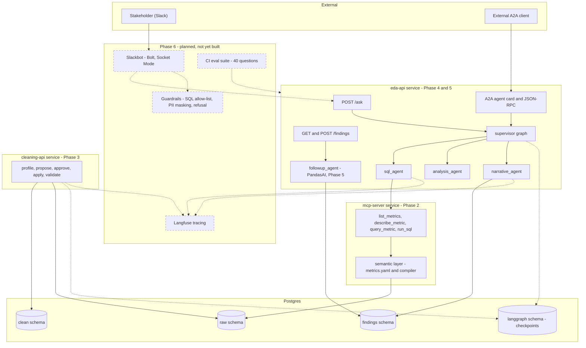

# Architecture

System design for the full 6-phase target, not just what's built so far. Phases
1-5 (foundation through PandasAI follow-ups) are built and tested; Phase 6
(Slackbot, Langfuse tracing, guardrails, CI eval) is marked **planned** below —
this doc exists so Phase 6 has a design to build against, not a blank page.

## Component diagram

Two design throughlines worth calling out explicitly, since they're the reason
several components look the way they do:

1. **Agents never write SQL from scratch against a live connection.** The
   semantic layer compiles metric requests deterministically; `run_sql` is a
   narrow, read-only escape hatch; the cleaning agent's fix strategies render
   SQL from a fixed menu, never from LLM free text. The one write path
   (`cleaning_graph`) is a separate, internal pipeline — never reachable from
   natural-language input.
2. **Judgment and computation are separate steps, repeated at every layer**:
   the semantic layer compiler (Phase 2), the cleaning agent's fix strategies
   (Phase 3), the analysis agent's lens classification (Phase 4), and
   PandasAI's generated-but-executed-in-a-controlled-DataFrame code (Phase 5)
   all follow "LLM picks from a constrained menu or supplies parameters, code
   computes the result."

## Failure modes

These are drawn from what the build actually hit or deliberately bounded —
not a hypothetical list.

| Failure | Current behavior | Gap / what Phase 6 needs to do |
|---|---|---|
| MCP server unreachable | `sql_agent` raises `RuntimeError` after exhausting its tool-use loop; supervisor eventually hits `max_turns` and marks the run `failed` | Bounded, but the plain `POST /ask`/`/cleaning-runs` endpoints don't catch this — it surfaces as an uncaught 500. The A2A executor already catches and reports as text; the REST endpoints don't. **Inconsistent, worth fixing before Phase 6**, not papering over. |
| Foundry/Anthropic API down or rate-limited | Same uncaught-exception gap as above at any LLM call site | Needs the guardrail layer's error handling to be uniform across all three entry points (REST, A2A, Slack) |
| Postgres unreachable | Any `app_engine()`/`readonly_engine()` call raises; same uncaught-exception gap | Same fix as above |
| Supervisor loop never converges | Hard-capped at `max_turns=8`, returns `status: "failed"` rather than looping forever | Working as intended; Phase 6 should decide what the Slackbot says on `failed` (currently `ask_question` just raises) |
| `sql_agent` tool-use loop never converges | Hard-capped at 6 turns, raises `RuntimeError` | Same |
| Cleaning-agent run left `awaiting_approval` forever | No TTL — the checkpoint just sits there | Not addressed; a real deployment needs either a TTL/cleanup job or to accept this as an acceptable operational characteristic for a low-volume internal tool |
| Semantic layer has no date-range filter | Phase 4's `analysis_agent` works around this *only* for `time_series_trend` questions (extracts a start/end and filters in pandas) | A simple point-value question naming a specific date range (not a trend) has no equivalent workaround — `sql_agent` would need to fall back to `run_sql` itself, which is possible but not guaranteed |
| PandasAI follow-up produces a chart | `chart_ref` is set to a **local filesystem path** (`exports/charts/...`) | Not reachable from Slack as-is; Phase 6 needs to either upload it somewhere fetchable or post the file directly via Slack's file-upload API |
| No guardrails yet | None of PII masking, SQL allow-listing beyond the read-only DB role, row limits as *policy* (vs. the soft defaults already in `query_metric`/`run_sql`), or out-of-scope refusal exist | Entirely Phase 6 scope, by design — building it now against an unstated spec would mean redoing it |
| No tracing yet | Nothing is instrumented with Langfuse | Phase 6 scope; every LLM call site in this codebase is already a narrow, named function (`propose_fixes`, `run_sql_agent`, `analyze`, `write_finding`, `_route`, `answer_followup`) specifically so wrapping them for tracing later is mechanical, not a refactor |

## Latency and cost per question

Based on actual call counts measured while building Phase 4 (not estimated),
and current Anthropic pricing (`claude-opus-5-5`: $4/$20 per MTok input/output,
prompt-cache reads $0.20/MTok ≈ 95% off; `claude-sonnet-5-5`: $2/$10 per MTok,
cache reads $0.20/MTok ≈ 90% off). Figures below use Opus 5.5, the default
model, with no prompt caching yet configured (a Phase 6 cost lever, not built).

| Question type | LLM calls | Rough tokens/call (in/out) | Est. cost/question | Est. latency |
|---|---|---|---|---|
| Simple point value (e.g. "total revenue?") | ~4–7 (supervisor routing ×2–3, sql_agent tool loop ×1–3, narrative ×1) | ~1.5K in / 300 out | ~$0.04–0.07 | ~10–20s |
| Trend / breakdown (adds analysis_agent) | ~6–9 | ~2K in / 400 out | ~$0.06–0.10 | ~15–30s |
| Follow-up (PandasAI) | 1 PandasAI call (itself 1–2 model calls for code-gen + the answer) + 1 narrative call | ~1K in / 300 out | ~$0.02–0.04 | ~8–15s |
| Cleaning run (per table, with findings) | 1 propose_fixes call | ~1–2K in / 500 out | ~$0.02–0.04 | ~10–20s |

**This table is the rubric Phase 6's CI eval reports against** (per the
ROADMAP's Phase 5 evaluation note) — not just descriptive numbers. Suggested
thresholds for Phase 6 to enforce: **flag a regression if p50 latency exceeds
30s for any question type, or if per-question cost exceeds $0.15** (roughly
2× the high end measured above, leaving headroom for legitimately harder
questions without masking a real regression).

Costs would drop substantially with prompt caching (the system prompts and
tool schemas in `sql_agent`/`narrative_agent`/`analysis_agent` are static
across calls — a clear, not-yet-taken Phase 6 optimization) and are not
currently using `claude-sonnet-5-5` for any of the cheaper, lower-judgment
calls (e.g. `classify_lens`, `route`) where it would likely hold quality at
roughly half the cost.
