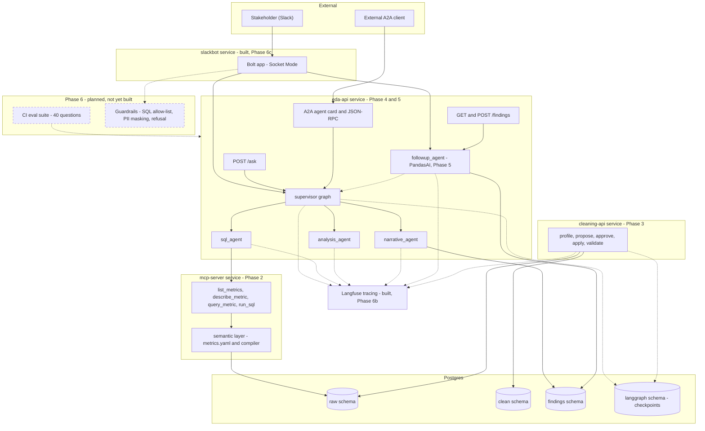

# Architecture

System design and measured behavior. All six phases are built and tested: data
foundation, semantic layer + MCP, cleaning agent, supervisor/EDA agents, PandasAI
follow-ups, and Phase 6 (guardrails, Langfuse tracing, Slackbot, CI-gated eval). The
component diagram below doesn't show the guardrails layer explicitly since it sits
inside `mcp-server`/`eda-api` rather than as a separate service -- see the
failure-modes table for what's built there.

## Component diagram

Two design throughlines worth calling out explicitly, since they're the reason
several components look the way they do:

1. **Agents never write SQL from scratch against a live connection.** The
   semantic layer compiles metric requests deterministically; `run_sql` is a
   narrow, read-only escape hatch; the cleaning agent's fix strategies render
   SQL from a fixed menu, never from LLM free text. The one write path
   (`cleaning_graph`) is a separate, internal pipeline — never reachable from
   natural-language input.
2. **Judgment and computation are separate steps, repeated at every layer**:
   the semantic layer compiler (Phase 2), the cleaning agent's fix strategies
   (Phase 3), the analysis agent's lens classification (Phase 4), and
   PandasAI's generated-but-executed-in-a-controlled-DataFrame code (Phase 5)
   all follow "LLM picks from a constrained menu or supplies parameters, code
   computes the result."

## Failure modes

These are drawn from what the build actually hit or deliberately bounded —
not a hypothetical list.

| Failure | Current behavior | Gap / what Phase 6 needs to do |
|---|---|---|
| MCP server unreachable | `sql_agent` raises `RuntimeError` after exhausting its tool-use loop; supervisor eventually hits `max_turns` and marks the run `failed` | **Built (Phase 6c).** All three entry points now catch broadly: REST returns a clean 502 instead of an uncaught 500, A2A and Slack post the error as a message — uniform, not just the A2A executor as before |
| Foundry/LLM API down or rate-limited | Same uncaught-exception gap as above at any LLM call site | **Built (Phase 6c).** Same uniform catch-and-report fix as above, applies at any LLM call site |
| Postgres unreachable | Any `app_engine()`/`readonly_engine()` call raises | **Built (Phase 6c).** Same uniform catch-and-report fix as above |
| Supervisor loop never converges | Hard-capped at `max_turns=8`, returns `status: "failed"` rather than looping forever | Working as intended; Phase 6 should decide what the Slackbot says on `failed` (currently `ask_question` just raises) |
| `sql_agent` tool-use loop never converges | Hard-capped at 6 turns, raises `RuntimeError` | Same |
| Cleaning-agent run left `awaiting_approval` forever | No TTL — the checkpoint just sits there | Not addressed; a real deployment needs either a TTL/cleanup job or to accept this as an acceptable operational characteristic for a low-volume internal tool |
| Semantic layer has no date-range filter | Phase 4's `analysis_agent` works around this *only* for `time_series_trend` questions (extracts a start/end and filters in pandas) | A simple point-value question naming a specific date range (not a trend) has no equivalent workaround — `sql_agent` would need to fall back to `run_sql` itself, which is possible but not guaranteed |
| PandasAI follow-up produces a chart | **Built (Phase 6c).** The Slackbot calls `answer_followup` directly in-process (not over HTTP to `eda-api`), so `chart_ref`'s local PNG path is on the Slackbot's own disk — uploaded via `files_upload_v2` in the same thread. Confirmed with a real file upload before relying on it, not just the OAuth scope. | None for Slack. The REST `/findings/{id}/followup` response still just returns the local path as-is — fine for this project's single-consumer-is-Slack scope, would need object storage for a REST client on a different host |
| `answer_followup` asked for data its parent finding doesn't have (e.g. "break that down by category" after a single aggregate) | **Built (Phase 6c), found via real Slack usage, not a written test.** Phase 5's "only ever see already-returned rows" guarantee is correct for a genuine recut but wrong here — there's nothing to recut. `_needs_fresh_data` classifies PandasAI's own answer as a reported data gap vs. a genuine answer; on a gap, falls back to a full `ask_question()` call, restating the parent question as explicit background first (two earlier phrasings were tried and failed against the real model before this one worked — see ROADMAP's Phase 6c summary) | None — covered. The fallback's finding has no `parent_finding_id` (it's not actually derived from the parent's data), by design |
| `run_sql` receives a data-modifying CTE | **Built (Phase 6a).** `sql_guard.validate_sql` walks the full AST, not just the top-level statement type (a data-modifying CTE's outer node parses as a harmless `Select`) — confirmed by parsing one, not assumed. Readonly DB role rejects it too (defense in depth), now redundantly. | None — covered, with tests proving both layers independently |
| A query asks for more rows than it should get | **Built (Phase 6a).** Hard ceiling (`MAX_ROW_LIMIT=1000`), clamped regardless of what's requested | None |
| Geolocation/zip columns leak via `run_sql` | **Built (Phase 6a), with a known, documented gap.** Masking matches OUTPUT column names — `SELECT geolocation_lat AS x` or `SELECT AVG(geolocation_lat)` both evade it entirely (no column provenance tracking through arbitrary SQL). `test_sql_guard.py` has a test *proving* the bypass exists, not just absence-of-bypass tests. | Would need column-provenance tracking or masked Postgres views to close properly — a real scope increase, deliberately not taken this phase |
| Out-of-scope question (weather, general knowledge, injection attempts) | **Built (Phase 6a).** `scope_guard.check_scope` gates `ask_question()` before the supervisor graph starts — verified against real in-scope questions (not falsely refused), real out-of-scope questions (refused), and adversarial/injection-flavored prompts against the classifier itself (held, but not proof against all such attempts — an LLM classifier is manipulable in principle; the structural backstop is that `sql_agent` can only ever reach Postgres through read-only MCP tools regardless of what the classifier decides) | Phase 6d's golden set is where borderline/ambiguous cases get rigorously scored, not just smoke-tested |
| Langfuse query-back doesn't expose model/usage/cost | **Built (Phase 6b).** Every direct LLM call site (`propose_fixes`, `run_sql_agent`'s per-turn loop, `write_finding`, `check_scope`, and the rare `extract_date_range`) is wrapped in `@observe(as_type="generation")` plus an explicit `record_generation()` call that forwards the real model/usage/cost onto the current span — not the auto-instrumentor (tested; it left those fields empty by default). Verified the SDK emits the right OTel span attributes locally, and separately confirmed (polling `client.api.observations.get_many` for 60+s after a real traced call) that this Langfuse Cloud org's own query-back API still returns `model`/`usage_details`/`cost_details` as `None` regardless — a backend-side gap, not something fixable from this project's side. `answer_followup` (PandasAI/LiteLLM) is the one call site with no raw `Message` to read usage off of — covered instead by LiteLLM's own native Langfuse callback, which logs to a separate, unlinked trace rather than nesting under `answer_followup`'s span. | Re-check cloud.langfuse.com's UI directly (not just the API) once this is deployed somewhere with browser access — the data may be visible there even if the v2 observations API doesn't surface it; if not, this is an open question for Langfuse support, not this project |

## Latency and cost per question

Measured (not estimated) on GPT-6.1-Sol via Azure Foundry (Global tier, $2 / $10 per
MTok input/output), one run per question type, by timing every LLM call. Latency is
dominated by the **number of sequential LLM calls** (each costs a ~1.5s floor plus
output tokens at ~75/s); database, MCP and chart work together take under a second.

| Question type | LLM calls | Tokens in / out | Cost/question | Latency |
|---|---|---|---|---|
| Single metric ("orders canceled?") | 4 | ~2.5K / ~150 | ~$0.007 | ~6s |
| Trend ("monthly revenue in 2017") | 4 | ~4.0K / ~210 | ~$0.010 | ~8s |
| Breakdown ("review score by category") | 4 | ~6.6K / ~360 | ~$0.017 | ~8s |
| Needs custom SQL ("% orders without line items") | 4 | ~2.6K / ~215 | ~$0.007 | ~8s |
| Out-of-scope refusal | 1-2 | ~1.2K / ~85 | ~$0.003 | ~2s |
| Follow-up (PandasAI) | 1 PandasAI call (1-2 model calls) + 1 narrative call | ~1K / ~300 | ~$0.02 | ~8-15s |

How a typical question gets to ~4 calls (it was 8-13 and 16-48s before a profiling
pass): supervisor routing is deterministic code; `sql_agent`'s prompt embeds the metric
catalogue, issues tool calls in parallel and replies "DONE"; the analysis lens comes
from the result's shape and simple date ranges are parsed by rules; the scope check runs
concurrently with the first SQL turn (tool calls wait on a gate, so out-of-scope
questions still never touch the data); and join keys are indexed. The eval suite
re-checks answer quality after every such change.

**Enforced in CI** (`eval/run_eval.py`, on pull requests): execution accuracy >= 90%,
faithfulness >= 90%, refusal correctness = 100%, p50 latency <= 30s (measured serially
on a 5-question probe, since the target is per-user, not under concurrent load). A
per-question cost ceiling is not enforced -- costs here are far below the originally
suggested $0.15, and prompt caching is not configured.
